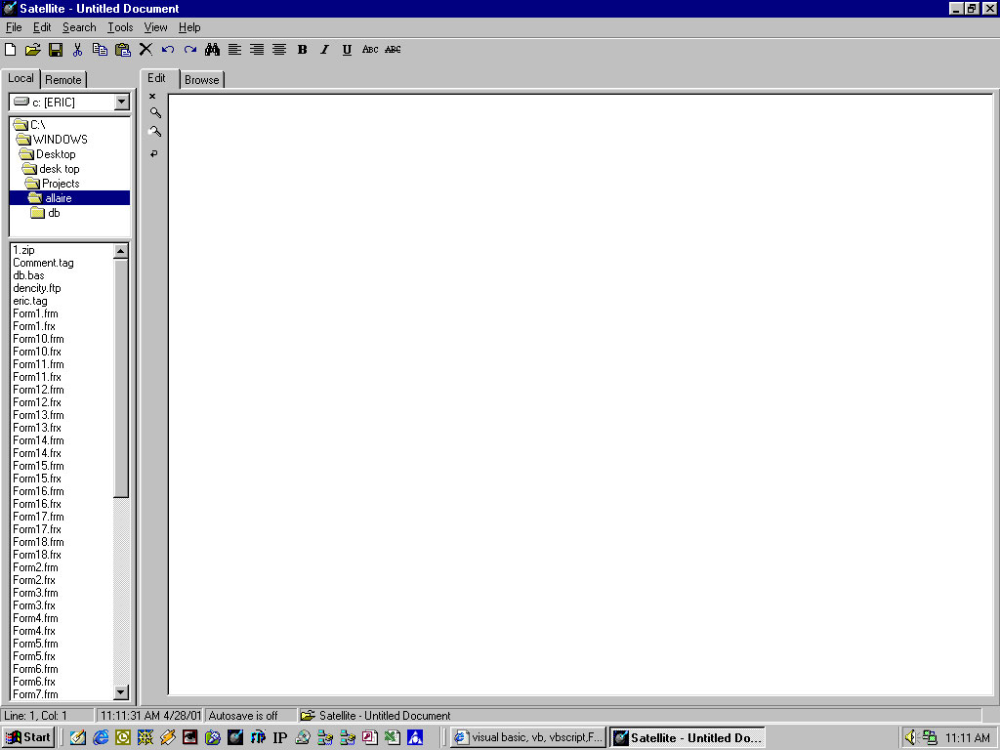



## Allaire ColdFusion Editor\!\!

### Description

I origanally started this with the question can I recreate Allaire's ColdFusion Editor?

Well the answer is Almost...

Mostly customizable has tons of features including.

ftp,ini creation deletion,richtextbox manipulation,saving files undo,redo,api's,splash srceen,all the usual editor capabilities.

Well check it out for yourself.

I worked long and hard on this so any feedback and or votes would really be appreciated.

Also any bugs or ideas can be sent to my email which is in form1 at the top along with all the credits to the people that I got ideas and or code from on PSC.

Thanks Eric C.
 
### More Info
 

             |
---                |---
**Submitted On**   |2001-04-29 13:32:54
**By**             |[Morpheous](https://github.com/Planet-Source-Code/PSCIndex/blob/master/ByAuthor/morpheous.md)
**Level**          |Intermediate
**User Rating**    |4.6 (51 globes from 11 users)
**Compatibility**  |VB 6\.0
**Category**       |[Complete Applications](https://github.com/Planet-Source-Code/PSCIndex/blob/master/ByCategory/complete-applications__1-27.md)
**World**          |[Visual Basic](https://github.com/Planet-Source-Code/PSCIndex/blob/master/ByWorld/visual-basic.md)
**Archive File**   |[Allaire Co189994302001\.zip](https://github.com/Planet-Source-Code/morpheous-allaire-coldfusion-editor__1-22782/archive/master.zip)

